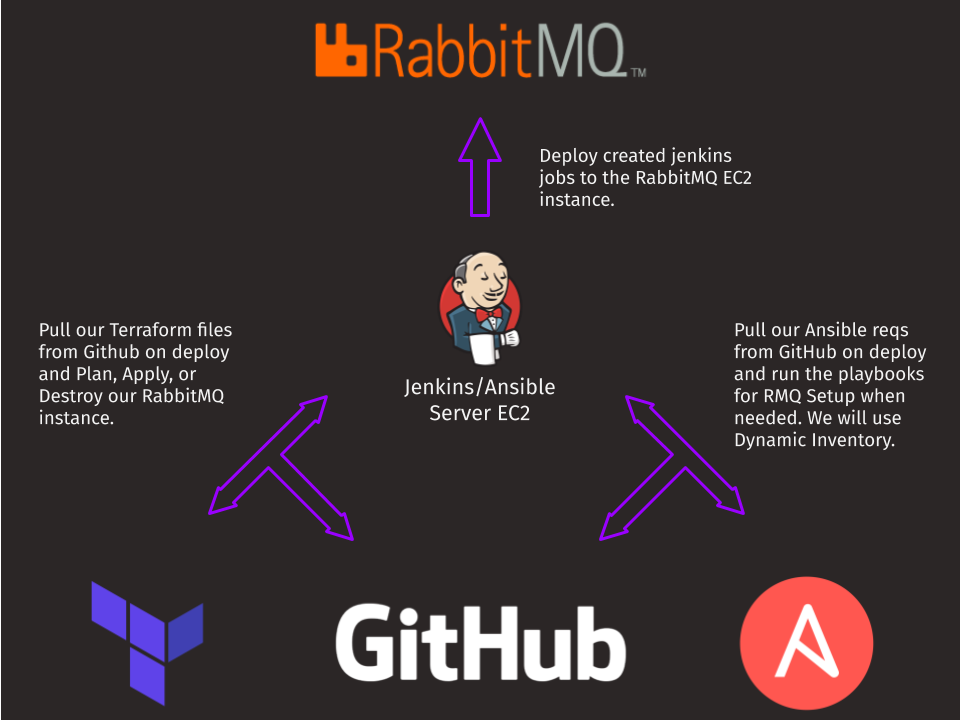

#

## Definition

> Dans ce didacticiel, nous construisons une infrastructure RabbitMQ dans AWS en utilisant Jenkins pour vérifier les référentiels terraform et ansible et les déployer. Rendez votre infrastructure immuable et reconstruisez-la en quelques clics.

> Nous utiliserons l'inventaire dynamique d'ansible pour remplir automatiquement les instances EC2 avec une balise de groupe AWS spécifique.

> Ce tutoriel offre une expérience Cloud, terraform et RabbitMQ. Notre script Ansible créera automatiquement notre utilisateur pour nous et nous pourrons nous connecter à notre tableau de bord d'administration RMQ.

- **AWS** pour notre fournisseur de cloud (GCP est mon plus faible, et bien que je puisse m'en sortir, je veux m'assurer que vous enlevez les concepts de base du cloud)
- **Terraform** pour notre infrastructure en tant que code
- **Ansible** pour notre configuration serveur (Avec Dynamic Inventory pour notre RMQ EC2)
- **Hôte Jenkins** et tâches pour déployer les fichiers Terraform et ansible
- **Instance RabbitMQ** dans EC2 et une direction à suivre pour apprendre les spécificités de RMQ.

